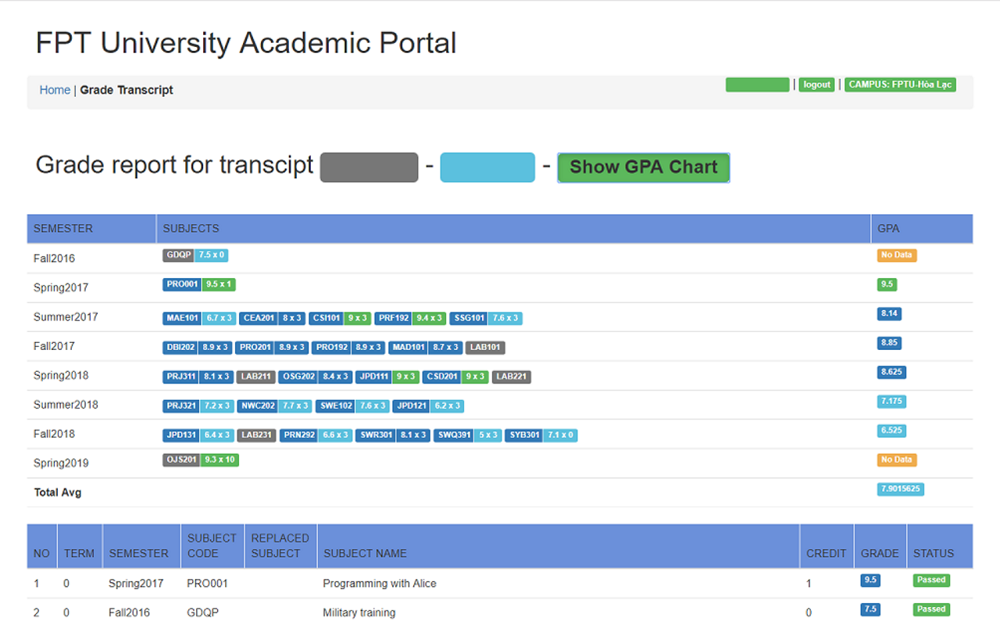

<h1 align="center" style="font-weight: bold">FU GPA</h1>

  A GPA calculator extenstion for FPT University students

<a href="#installation">Installation</a> - <a href="#functionality">Functionality</a> - <a href="#guide">Guide</a>

# Installation
Install the Chrome extenstion [here](https://chrome.google.com/webstore/detail/fpt-gpa/pieacoaichghpileamnhephkedchnlba)

# Functionality
- Calculate semester's average GPA based on the number of subjects and credits of each subject
- Calculate curriculum's average GPA
- Configure the subjects that the GPA calculator will ignore (Vovinam, Military training, Traditional musical instruments, .etc)

# Guide
- "Show GPA" BUTTON: Toggle GPA calculator table
- "Add subjects to ignore list" INPUT: Add the subject code that you want to ignore (trailing numbers not required)
- "Default" BUTTON: Set the GPA ignore list to default
- "Save" BUTTON: Save GPA ignore list to Local Storage

Icons made by <a href="https://www.freepik.com/" title="Freepik">Freepik</a> from <a href="https://www.flaticon.com/" 			    title="Flaticon">www.flaticon.com</a> is licensed by <a href="http://creativecommons.org/licenses/by/3.0/" 			    title="Creative Commons BY 3.0" target="_blank">CC 3.0 BY</a>